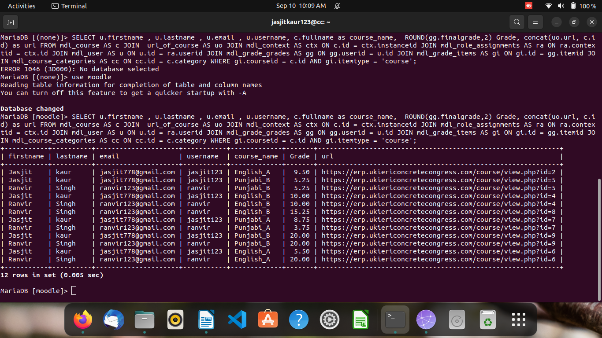

# Sql-Query

```
SELECT u.firstname , u.lastname , u.email , u.username, c.fullname as course_name,  ROUND(gg.finalgrade,2) Grade, concat(uo.url, c.id) as url FROM mdl_course AS c JOIN  url_of_course AS uo JOIN mdl_context AS ctx ON c.id = ctx.instanceid JOIN mdl_role_assignments AS ra ON ra.contextid = ctx.id JOIN mdl_user AS u ON u.id = ra.userid JOIN mdl_grade_grades AS gg ON gg.userid = u.id JOIN mdl_grade_items AS gi ON gi.id = gg.itemid JOIN mdl_course_categories AS cc ON cc.id = c.category WHERE gi.courseid = c.id AND gi.itemtype = 'course';

```



